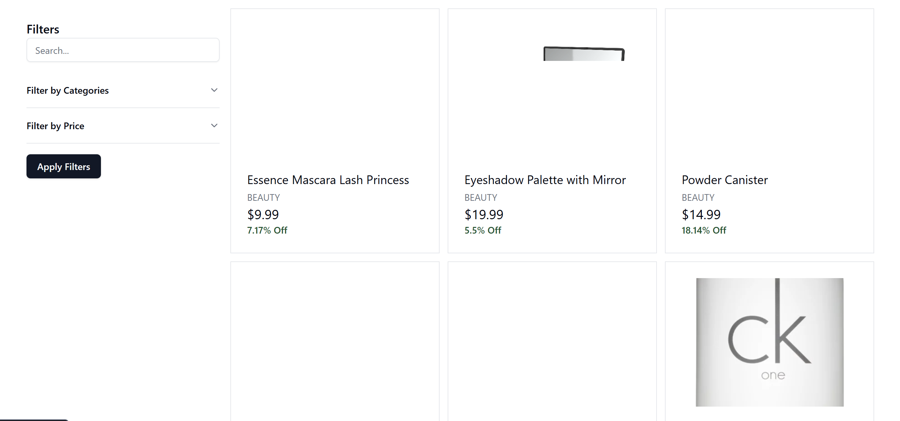
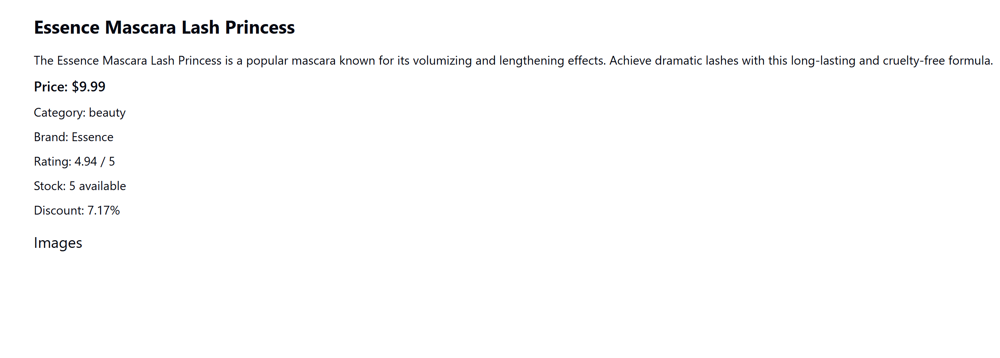
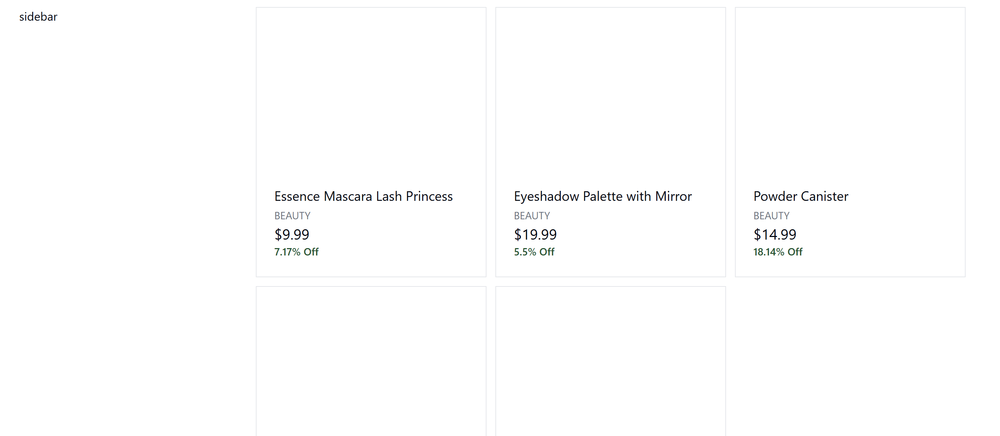

# Vite Project

## How to Run

1. Install [Node.js](https://nodejs.org/) (includes npm).
2. Clone the repository:
   ```bash
   git clone <repository-url>
   ```
3. Navigate to the project folder:
   ```bash
   cd <project-folder>
   ```
4. Install dependencies:
   ```bash
   npm install
   ```
5. Start the development server:
   ```bash
   npm run dev
   ```
6. Open [http://localhost:5173](http://localhost:5173) in your browser.

## Screenshots

### Home Page

Displays a list of featured products.


### Product Details

Shows detailed information about a specific product.


### Filter by Category

Filters products by category for easy browsing.

